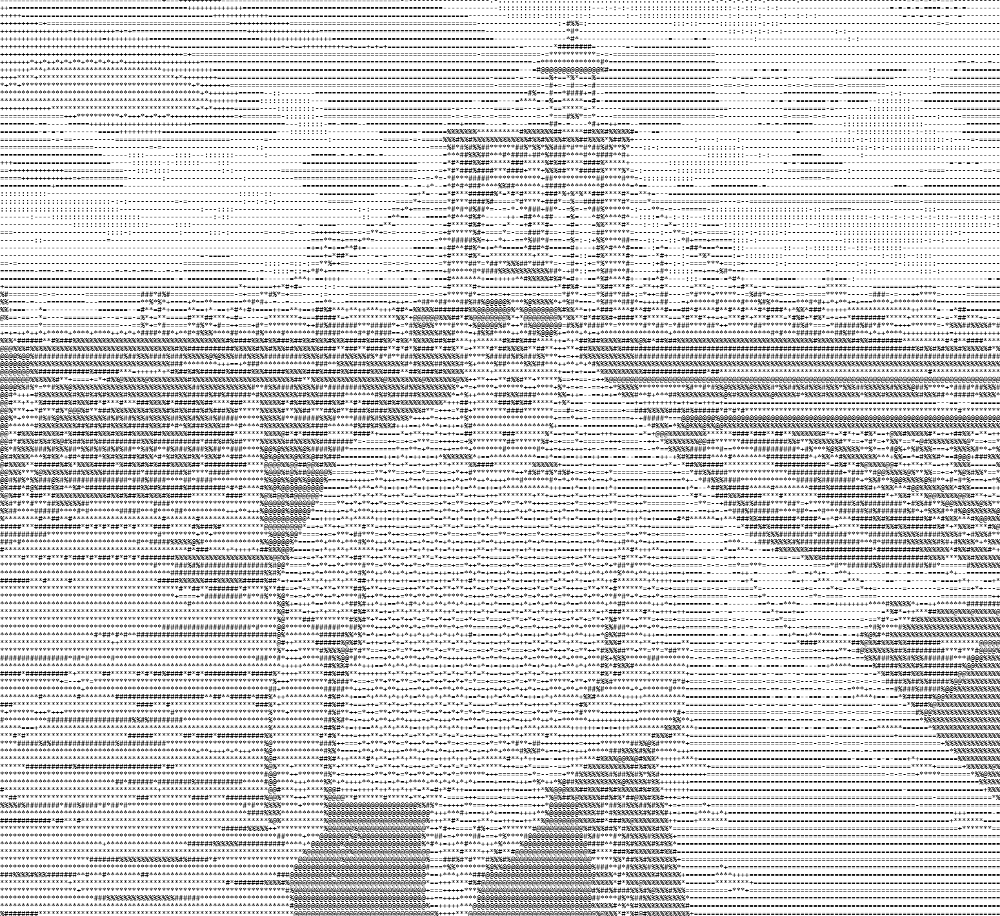

# Home

This website is a culmination of my notes I compiled while going for OSCP. They consist of notes from the course material, techniques learned through practice labs, and any additional information learned through a few HTB and THM resources.

Check out my portfolio site for walkthroughs and other projects
[charliehacks.computer](https://charliehacks.computer)

My LinkedIn for anyone curious or who wants to connect [LinkedIn Profile](https://www.linkedin.com/in/charles-sampson/))

